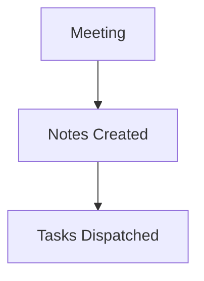

# Backend Team Sprint Sync #42

# Backend Team Sprint Sync #42

## Summary
[00:05] Alice: Good morning team. Let's do a quick sync on our sprint goals.
[00:15] Bob: I completed the user authentication refactor yesterday. Today I will begin optimizing the PostgreSQL indexes on the transactions table because query latency jumped to 450ms.
[00:45] Alice: Great Bob, please open a GitHub issue to track the PostgreSQL indexing task with P1 priority.
[01:05] Charlie: I investigated the Redis cache eviction issue. It turns out our TTL settings were set too low. I will fix the Redis TTL configuration and deploy to staging this afternoon.
[01:30] Alice: Excellent. Also, we not...

