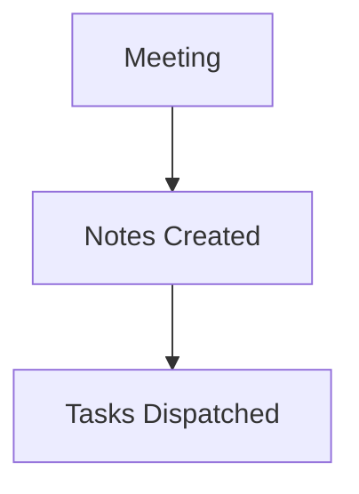

# CS301 Lecture 14: Shortest Paths and Dijkstra Algorithm

# CS301 Lecture 14: Shortest Paths and Dijkstra Algorithm

## Summary
[00:00] Professor Smith: Welcome everyone. Today we are exploring shortest path algorithms, specifically Dijkstra's algorithm and comparing it with Breadth-First Search.
[02:15] Professor Smith: Remember, Dijkstra relies on a min-priority queue and non-negative edge weights. If edge weights are negative, we must use the Bellman-Ford algorithm instead.
[08:30] Professor Smith: Take a look at the whiteboard diagram: Vertex A connects to B with weight 4, and to C with weight 2. We greedily relax edges until all vertices are visited.
[14:10] Professor Smith: For your homework assignment due this F...

