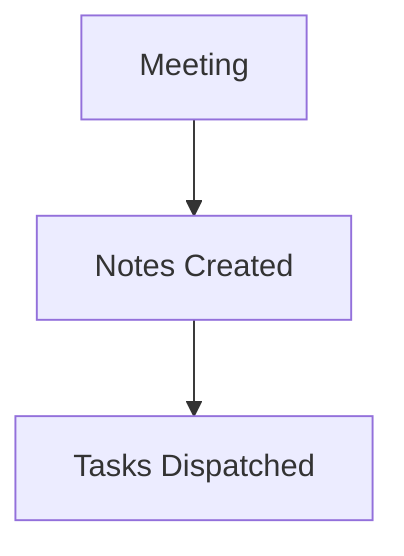

# Incident 2026-09-12 Postmortem: Production Auth Outage

# Incident 2026-09-12 Postmortem: Production Auth Outage

## Summary
[00:00] Sarah (SRE): Incident postmortem for yesterday's 22-minute auth service disruption.
[00:30] Kevin (Security): The root cause was an expired signing certificate on the OAuth proxy that was not caught by automated health checks.
[01:10] Sarah: First action item: Kevin will add a cert-manager alerting rule in Prometheus to trigger a P0 alert 14 days before certificate expiration.
[01:50] Kevin: Understood. Second action item: we need an automated key rotation script in Terraform so cert renewals do not require manual secret deployment.
[02:30] Liam (Backend): Third action item: I will upd...

