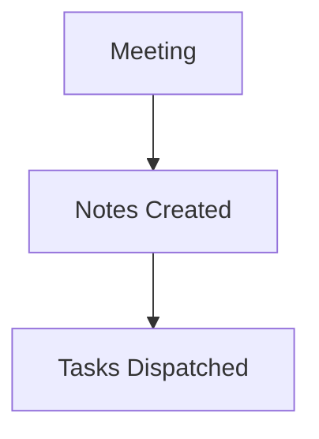

# InsightFlow Architecture & Reliability Sync

# InsightFlow Architecture & Reliability Sync

## Summary
[00:00] Alice: Welcome to the InsightFlow Architecture Sync.
[00:20] Bob: I investigated the AssemblyAI key rotation bug. The fix is to add backoff retries when all slots are occupied.
[00:50] Alice: Great Bob, open a GitHub issue with high priority for the AssemblyAI backoff queue.
[01:15] Charlie: I will update the Notion integration documentation to show how webhook fallbacks work.
[01:40] Alice: Thanks team. Please broadcast our sprint progress to #general on Slack....

