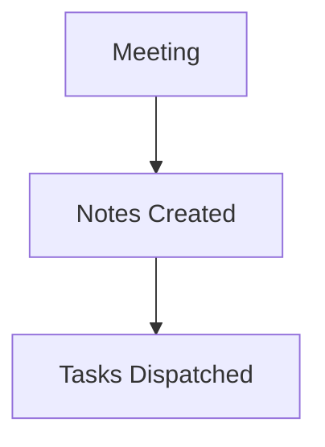

# Marketing & Docs Quick Alignment

# Marketing & Docs Quick Alignment

## Summary
[00:00] Emma: Hey Jack, just a quick 2-minute sync on the v1.2 release notes.
[00:20] Jack: Everything looks ready. I just need to update the API migration guide in the repository documentation to explain the new agent endpoint headers.
[00:45] Emma: Awesome! File an issue for that in GitHub, record the changelog in Notion, and post a quick heads up in #general on Slack when finished.
[01:05] Jack: Done, will have it done in thirty minutes!...

