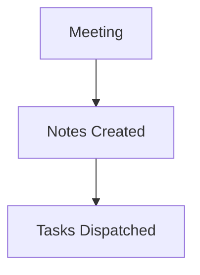

# Onboarding Redesign UX Review

# Onboarding Redesign UX Review

## Summary
[00:10] Maya (Lead Designer): Thanks for joining everyone. We are reviewing the new 3-step onboarding flow for InsightFlow.
[00:40] David (PM): The dropoff rate on step 2 was 34%. Users feel overwhelmed by the permission prompt for microphone access.
[01:15] Maya: Let's change the copy to explain that audio is processed locally and securely. Action item for David: write the updated explanatory microcopy by tomorrow noon.
[02:00] Leo (Frontend Dev): I will implement a skip button for step 2 so users can explore sample notes before committing permissions. I'll open a GitHub issue for the skip bu...

